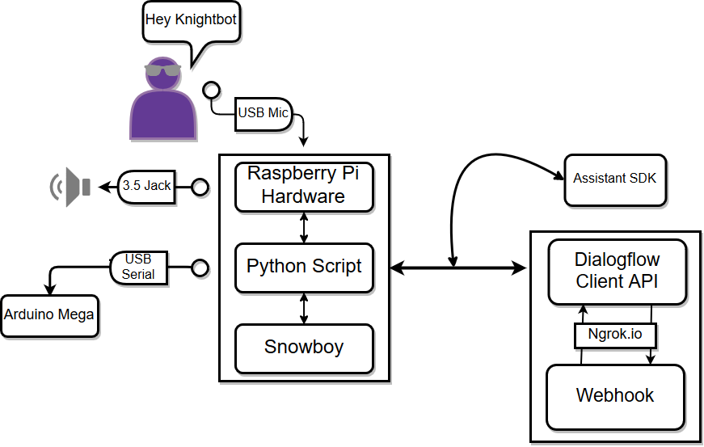

# Knightbot

Knightbot is an implementation of Google's Assistant Python SDK and the Dialogflow Python Client, wrapped nicely inside a
robot powered by Arduino and Raspberry Pi.

###### Created as a research project for MGSU's Robotics Lab. It was designed to serve the campus by answering questions like "When does Professor Miller have office hours?" or "When is the graduation ceremony?"

  - Utilizes [Snowboy Hotword Detection](https://github.com/Kitt-AI/snowboy), [GoogleTTS](https://github.com/glutanimate/simple-google-tts), and [Flask Assistant](https://github.com/treethought/flask-assistant).
  - Fully customizable Assistant, including hotword and physical response, movement, and voice
  - Returns responses Dialogflow can handle, and forwards the rest to Assistant API

 
 
 
 
 
 
## Setup
After a fresh install of Raspian, make sure to
```sh
$ sudo apt get update
```
And then configure SSH with
```sh
$ sudo raspi-config
```
and setup a static IP inside
```sh
$ sudo nano /etc/dhcpcd.conf
```

#### Running the Assistant
Follow the instructions [here](https://github.com/googlesamples/assistant-sdk-python/tree/master/google-assistant-sdk/googlesamples/assistant/grpc) to install the assistant. Make sure to create a Google Project and properly setup credentials. Put the ```credentials.json``` (not the ```client_secret.json```) in the same directory as ```knightbot.py```.

#### Installing Dialogflow
```sh
pip install dialogflow
git clone -b release-dialogflow-python-client-v2-0.1.0 https://github.com/dialogflow/dialogflow-python-client-v2 /path/to/working/directory
```
Note, this clones an older repo. The newer version should work, but hasn't been tested yet.

Once cloned, cd into the ```samples ``` directory and 
```sh
nano detect_intent_audio.py
```
At the end of the detect_intent_audio() function and replace the print statements with ```return response```. It should look like this:
```py
response = session_client.detect_intent(
        session=session, query_input=query_input,
        input_audio=input_audio)

    return response
    #print('=' * 20)
    #print('Query text: {}'.format(response.query_result.query_text))
    #print('Detected intent: {} (confidence: {})\n'.format(
    #    response.query_result.intent.display_name,
    #    response.query_result.intent_detection_confidence))
    #print('Fulfillment text: {}\n'.format(
    #    response.query_result.fulfillment_text))
```

This is done so that you can call ```detect_intent_audio()``` and handle the response yourself. To run this, Dialogflow requires a ```project_id``` (so make sure to keep track of this), a ```session_id``` (which ```knightbot.py``` randomly generate), an audio file input and a language code.

#### Installing Flask Assistant
Follow the instructions [here](https://flask-assistant.readthedocs.io/en/latest/quick_start.html) to setup the webhook and flask app (Or make your own webhook, instructions for Dialogflow webhook specifications can be found [here](https://developers.google.com/actions/build/json/dialogflow-webhook-json)).

Note: Flask Assistant has not yet been updated to work with Dialogflow's V2 API, and this project's Agent uses the V1 API. If you are making your own webhook, then make sure to follow V2 specifications.

#### Installed Google TTS
You can get the TTS from [here](https://github.com/glutanimate/simple-google-tts). The setup is relatively easy, just move the ```simple_google_tts``` and ```speak.pl``` files into the same directory as ```knightbot.py```.

#### Installing Snowboy
You can download Snowboy [here](https://github.com/kitt-ai/snowboy). There are precompiled binaries, but it is recommended to install it manually. Make sure to create the Python Wrapper. You may install Snowboy in it's own directory, but move the provided ```ding.wav``` and ```dong.wav``` files to ```knightbot.py```'s direrectory, or create your own soundfiles. Make sure to put your .pmdl file inside the same directory as well.

Note: audio setup is a large hassle, because different components of the project use different audio setups (i.e. Pulseaudio vs Alsa vs. PortAudio). Make sure to configure these with scrutiny, and make use of the Raspberry Pi's ```.asoundrc``` file.

#### Final Setup
To have Knightbot function independently, we boot up the Pi into "Console AutoLogin" mode, which can be under Boot Options, then Desktop/CLI inside
```sh
sudo raspi-config
```
Make sure you have a working static IP at this point so you can access the Pi without an HDMI cable.

Finally, to run the script on startup, do 
```sh
nano /etc/profile
```
and add the following lines at the bottom:
```sh
source env/bin/activate
cd /path/to/knightbot.py
export GOOGLE_APPLICATION_CREDENTIALS='/path/to/Dialoglow/Credentials'
export AUDIODEV=hw:0,0 #the two numbers here will depend on your audio setup, and the ports that the microphone and speaker use. 
python knightbot.py
```

###### Warning: running these lines and booting into Desktop mode will crash the Pi. 
There are other ways to run ```knightbot.py``` on startup, each with pro's and con's. 

Finally, get the following dependencies:
```sh
pip install pyserial
pip install json
pip install uuid
```

##Arduino / Raspberry Pi / Webhook Setup

Simply connect the Arduino and Pi via serial cable to connect them. We use pySerial to communicate between the two. We use a 3 digit number (x.y.z), which the Arduino interperets as commands, X for an LED matrix (intended for the eyes), Y for the head servo, and z for the wheels. This is completely customizable, just edit the Arduino files and wire up your own motors.

The webhook has several python modules that you may edit. Ideally, they'd be connected to a database, we have provided a list with a few examples to show off what you can do with them. Read up on the Flask Assistant documentation to see what you can do.


